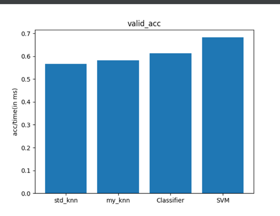

# Sentence Feature Extraction

This repository contains code to extract features from sentences samples using natural language processing techniques.

## Dependencies
- nltk
- numpy
- sklearn

## Sample Input File Format
The sample input file should be in the following format:
```
This is a sentence 1
[sentence] [label]
```

To change the file path, modify the attribute under the `main()` function in the `main.py` file:

```python
dir_path = 'sentiment labelled sentences'
file_name = 'amazon_cells_labelled.txt'
```

## Output
The output includes the feature size and sample features.

Sample output:
```
Feature size: 1000 * 1595
Sample line: So there is no way for me to plug it in here in the US unless I go by a converter. 0
For my_knn:
scal_time: 3.5762786865234375e-06
pred_time: 82.61364412307739
{'scal_time': [0.0003948211669921875, 3.5762786865234375e-06, 1.0912606716156006, 8.40349292755127], 'pred_time': [0.1544201374053955, 82.61364769935608, 1.095062017440796, 13.197337865829468], 'test_acc': [0.6688888888888889, 0.6666666666666666, 0.76, 0.8022222222222222], 'train_acc': [0.7857142857142857, 0.7895238095238095, 1.0, 0.9747619047619047], 'valid_acc': [0.6533333333333333, 0.6688888888888889, 0.7666666666666667, 0.8222222222222222]}
```

## Usage
You can comment out the code you don't want to use by adding `#` in front of the line. For example, to disable tf-idf feature extraction, do the following:

```python
# X = tf_idf_feature(X)
```

Run `main.py` to execute the feature extraction process.

## About the File Structure
For hw2, the three files have been combined to get a detailed result.

The output includes prediction accuracy and running times in plot format. To view more details, install Matplotlib.

The file mainly consists of algorithms used to evaluate different methods. The methods used are:
```python
method_list = {'std_knn': KNeighborsClassifier(n_neighbors=5), 'my_knn': KNN(5),
               'Classifier': DecisionTreeClassifier(random_state=0),
               'SVM': make_pipeline(StandardScaler(), SVC(gamma='auto'))}
```

## Dataset Split
The dataset is split as follows:
- 70% as training
- 15% as validation
- 15% as testing

The split is done randomly with a seed value of 43.

## Pruned Data
The program uses tf-idf to select the 512 data points with the largest tf-idf values (most important).

## Report
The implemented KNN algorithm works as follows:
- Includes every training data as the model
- In prediction:
    - Selects the nearest K neighbors
    - Uses majority vote for the most frequent label to determine the prediction

### Assumptions
- For std_knn, the number of neighbors is set to 5.
- For tree classifier, default settings are used.
- For SVM, StandardScaler is used to scale the dataset.

## Running Results
- For classifier decision tree, the following images are using tf-idf extracting first 512 features (FV-1):



- Without extraction (FV-2):


## Algorithm Analysis
### KNN Advantages:
- Quick construction
- Easy to build

### KNN Disadvantages:
- Long prediction time
- Inefficient for high-dimensional data
- Stores all training data, leading to wastage of space

### Classifier Advantages:
- Less construction time compared to SVM
- Uses the original data

### Classifier Disadvantages:
- A deep decision tree can take up a significant amount of time and space

### SVM Advantages:
- Higher accuracy for validation and training test data, demonstrating better generalization capability
- Lower prediction time for non-pruned (original) data

### SVM Disadvantages:
- Takes more time to construct

## License
[MIT](https://choosealicense.com/licenses/mit/)

## References
- [KNN](https://scikit-learn.org/stable/modules/generated/sklearn.neighbors.KNeighborsClassifier.html)
- [Decision Tree](https://scikit-learn.org/stable/modules/generated/sklearn.tree.DecisionTreeClassifier.html)
- [SVM](https://scikit-learn.org/stable/modules/generated/sklearn.svm.SVC.html)
- [Matplotlib](https://matplotlib.org/stable/api/_as_gen/matplotlib.pyplot.plot.html)
- [Numpy](https://numpy.org/doc/stable/reference/generated/numpy.array.html)
- [NLTK](https://www.nltk.org/)
